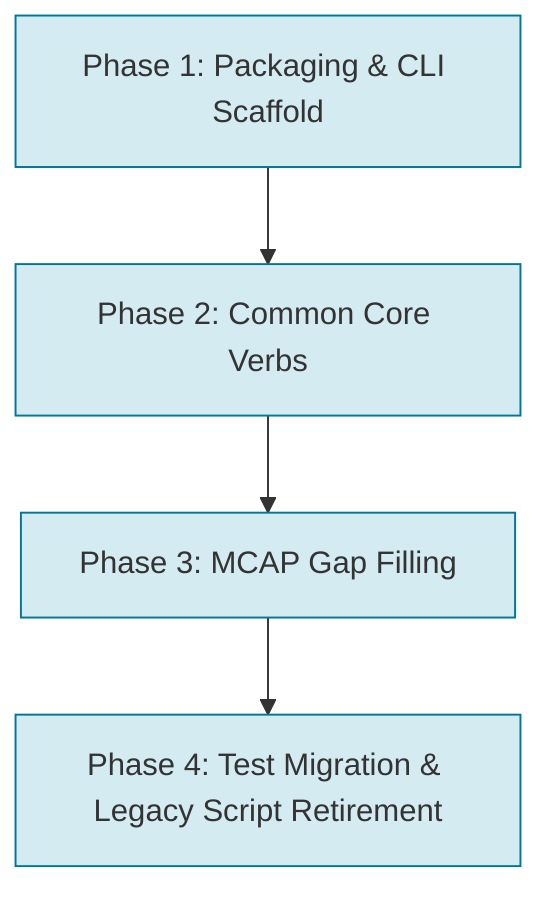

# ASL 2.0: Unified CLI & Architecture Design

## Executive Summary & Motivation

The `ardusub_log_tools` repository currently contains over 70 standalone Python scripts sitting flat in the root directory. Most tools are specialized by format prefix (`BIN_*`, `tlog_*`, `mcap_*`), resulting in widespread code duplication, inconsistent command-line conventions, and notable capability gaps between formats. Furthermore, running these tools from external project environments (such as `seaq_logs` or `orca5_1_tests`) is fraught with friction due to lack of standard packaging, flat namespace pollution, and differing dependencies.

**ASL 2.0** introduces a modern, consolidated architecture centered around a single entry point: `asl` (or `asl.py`).

### Key Principles
1. **Verb-Centric Interface**: Instead of format-prefixed scripts (`BIN_explode.py`, `tlog_explode.py`, `mcap_explode.py`), users invoke high-level verbs (`asl explode`, `asl merge`, `asl timeline`, `asl messages`).
2. **Format Polymorphism**: The CLI inspects input file formats (`.BIN`, `.tlog`, `.mcap`) and automatically dispatches to the corresponding parser backend while exposing uniform flags and output conventions.
3. **Explicit Type Selection**: Tools require explicit specification (`--types <list>` or `--all`), eliminating arbitrary defaults and accidental massive file dumps.
4. **Raw by Default**: Message extractions preserve full raw data by default; data cleaning or filtering (e.g. invalid GPS) is strictly opt-in.
5. **Standardized Python Packaging**: Transforms `ardusub_log_tools` into an installable Python package (`pip install -e .`) providing the `asl` console executable, eliminating `sys.path` hacks and environment hopping.
6. **Clean Cutover**: Legacy standalone scripts (`BIN_*.py`, `tlog_*.py`, etc.) are directly replaced and retired without intermediate forwarding shims.

---

## Command Line Interface (CLI) Specification

### Universal Verb Syntax
```bash
asl <verb> [options] <path ...>
```

### Format-Specific Subcommands
For tools unique to a container format (e.g. video extraction from MCAP, `@SYS/` extraction from Dataflash):
```bash
asl <format> <subcommand> [options] <path ...>
```

### Global Options
Common across all verbs:
- `-r`, `--recurse`: Recursively scan directories for compatible log files.
- `-v`, `--verbose`: Enable detailed processing logs.
- `-o`, `--output-dir <DIR>`: Write generated artifacts to a designated directory instead of alongside input files.
- `--segments <FILE|JSON>` / `-s`: Apply time segmentation filter (supports `utc_plan.json` or inline JSON).
- `--keep <START,END[,NAME]>`: Command-line segment specification.

---

## Core Verbs & Parameter Specifications

### 1. `explode`
Extracts message types or channels into separate CSV files (`<base>_asl_[<segment>_]<type>.csv`).
- **Syntax**: `asl explode (--types <TYPES> | --all) [options] <files...>`
- **Parameters**:
  - `--types <T1,T2,...>`: **Required** (unless `--all`). Comma-separated list of message types or group presets:
    - Group presets supported:
      - `--types ekf`: Expands to all EKF tables (`XKF1`..`XKFS` for `.BIN`, `EKF_STATUS_REPORT` for `.tlog`/`.mcap`).
      - `--types nav`: Expands to navigation/attitude tables (`GPS`, `POS`, `ATT` for `.BIN`; `GLOBAL_POSITION_INT`, `ATTITUDE` for `.tlog`/`.mcap`).
    - MCAP extension topics supported directly: e.g. `--types wl_dvl,wl_ugps`.
  - `--all`: **Required** (unless `--types`). Extract every message type discovered in the log file.
  - `--rate`: Boolean flag. When set, appends a `<type>.rate` column to the CSV containing calculated instantaneous delivery frequency (Hz).
  - `--filter-bad-gps`: Opt-in filter to drop invalid GPS fixes (`fix_type < 2`, or `(0, 0)`). Default is raw unfiltered output.
  - `--sysid <INT>`: Filter by MAVLink system ID (MAVLink/MCAP; ignored cleanly for `.BIN`).
  - `--compid <INT>`: Filter by MAVLink component ID (MAVLink/MCAP; ignored cleanly for `.BIN`).
  - `--split-source`: Split messages into separate CSVs by source `(sysid, compid)`.
  - `--system-time`: Use vehicle `time_boot_ms` / `time_unix_usec` instead of transport/log timestamps.
  - `--limit <N>` / `--max-rows <N>`: Optional row limit for quick inspection (default: unlimited, no arbitrary 500k cap).
- **Replaces**: `BIN_explode.py`, `tlog_explode.py`, `mcap_explode.py`, `mcap_explode_extension_logs.py`.

### 2. `merge`
Stitches multiple message types into a single wide, time-aligned CSV using forward-fill (`<base>_asl_[<segment>_]merged.csv`).
- **Syntax**: `asl merge (--types <TYPES> | --all) [options] <files...>`
- **Parameters**:
  - `--types <T1,T2,...>` / `--all`: **Required** explicit type selection (same semantics and group presets as `explode`).
  - `--rate`: Boolean flag. Appends calculated message rate columns.
  - `--filter-bad-gps`: Opt-in filter to drop invalid GPS fixes.
  - `--sysid <INT>`, `--compid <INT>`, `--split-source`: MAVLink source filtering and splitting.
  - `--system-time`: Use vehicle timestamp instead of log transport time.
  - `--limit <N>` / `--max-rows <N>`: Optional limit on merged row count (default: unlimited).
- **Replaces**: `BIN_merge.py`, `tlog_merge.py`, `mcap_merge.py`.

### 3. `types` (Inspect)
Scans logs and prints an interactive ASCII table to stdout detailing message types, record counts, and effective delivery rates.
- **Syntax**: `asl types [-r] <files...>`
- **Parameters**:
  - `-r`, `--recurse`: Scan directories for supported logs.
- **Behavior**: Strictly focused on vehicle messages across `.BIN`, `.tlog`, and `.mcap` (`mavlink/out`). Container topic/channel discovery for MCAP is handled via `asl mcap channels`.
- **Replaces**: `show_types.py`, `mcap_types.py`.

### 4. `timeline`
Generates a human-readable chronological event timeline: flight mode transitions, arm/disarm events, pilot commands, failsafes, and EKF status changes.
- **Syntax**: `asl timeline [options] <files...>`
- **Output**: Automatically writes `<base>_asl_timeline.txt` alongside the input log file.
- **Parameters**:
  - `--no-ansi`: Disable ANSI color escape codes (colors are enabled by default for terminal readability).
  - `--tz <TIMEZONE>`: Display event timestamps in the specified timezone (default: UTC).
- **Gap Filled**: **Adds `.mcap` support!** Extracts `HEARTBEAT`, `STATUSTEXT`, `COMMAND_LONG`, `EKF_STATUS_REPORT` from `mavlink/out`.
- **Replaces**: `BIN_timeline.py`, `tlog_timeline.py`.

### 5. `messages`
Extracts textual logs, operator status announcements, event codes, and hardware/subsystem error definitions.
- **Syntax**: `asl messages [options] <files...>`
- **Output**: Automatically writes `<base>_asl_messages.txt` alongside the input log file.
- **Parameters**:
  - `--summary`: Output a frequency histogram of unique messages and counts instead of the default chronological event stream.
- **Behavior**: Captures all messages unfiltered (no severity thresholds applied).
- **Gap Filled**: Unified decode across BIN (`MSG`, `EV`, `ERR` error codes) and MAVLink (`STATUSTEXT`), and **adds `.mcap` support**.
- **Replaces**: `BIN_messages.py`, `tlog_messages.py`.

### 6. `params`
Extracts vehicle parameters, tracks parameter modifications across the flight, and exports `.params` files.
- **Syntax**: `asl params [options] <files...>`
- **Output**: Writes `<base>_asl_params.params` containing the final parameter state.
- **Parameters**:
  - `--changes`: Report parameter modifications that occurred mid-flight or across logs instead of writing the snapshot file.
  - `--names <pattern>`: Filter parameters to track using exact names or wildcards (e.g. `--names 'EK3_*'` or `--names SURF_DEPTH,BATT_CAPACITY`).
- **Gap Filled**: **Adds `.mcap` support** (parses `PARAM_VALUE` on `mavlink/out`).
- **Replaces**: `BIN_param.py`, `tlog_param.py`.

### 7. `map`
Generates interactive Leaflet HTML maps (`<base>_asl_map.html`) with GPS tracks, EKF positions, and acoustic fixes.
- **Syntax**: `asl map [options] <files...>`
- **Parameters**:
  - `--sources <list>`: Comma-separated list of trajectory sources to include (default: auto-plots all available GPS, EKF/POS, and UGPS tracks as distinct toggleable colored layers).
  - `--max-hdop <float>`: Filter out fixes with HDOP > max (default: 2.0).
  - `--zoom <int>`: Initial Leaflet map zoom level (default: 18).
  - `--lat <float>`, `--lon <float>`: Center coordinates (default: mean of all plotted coordinates).
- **Replaces**: `BIN_map_maker.py`, `tlog_map_maker.py`, `mcap_map_maker.py`.

### 8. `plot`
Generates 2D trajectory or sensor profile visualization plots.
- **Subcommands**:
  - `asl plot local [options] <files...>`: Plots local NED X/Y trajectory (`<base>_asl_local.pdf`).
    - `--dvl`: Include DVL dead-reckoning trajectory (`VISO`).
  - `asl plot altitude [options] <files...>`: Plots barometer vs depth vs rangefinder over time (`<base>_asl_altitude.pdf`).
  - `asl plot transect [options] <files...>`: Plots transect health, SURFTRAK consistency, and terrain tracking (`<base>_asl_transect.pdf`).
- **Parameters**:
  - `--format <pdf|png>`: Output graphic format (default: `pdf`).
  - `--show`: Display plot interactively on screen instead of saving to file.
- **Replaces**: `BIN_plot_local.py`, `tlog_plot_local.py`, `mcap_plot_local.py`, `BIN_plot_transect.py`, `BIN_plot_viso.py`, `BIN_graph_alt.py`.

### 9. `info`
Displays high-level log metadata: duration, timestamps, vehicle firmware version, arming time, and hardware subsystem health.
- **Syntax**: `asl info <files...>`
- **Replaces**: `BIN_info.py`, `tlog_info.py`, `mcap_channels.py`.

### 10. `split`
Splits a monolithic log file into separate sub-logs based on flight mode or time segments.
- **Syntax**: `asl split (--mode [MODES...] | --segments <PLAN> | --keep <...>) <files...>`
- **Parameters** (Mutually Exclusive):
  - `--mode [MODES...]`: Split log into sub-logs by flight mode (`<base>_asl_mode_<mode>.<ext>`). Default splits all active modes.
  - `--segments <FILE>` / `--keep <START,END,NAME>`: Split log into sub-logs by time windows (`<base>_asl_seg_<name>.<ext>`).
- **Replaces**: `split_by_mode.py`, `tlog_segment.py`.

### 11. `dive`
Comprehensive dive directory analysis and log correspondence tool. Establishes boot cycles, time alignment (`rtc_shift_s`), file correspondences, and writes `dive_logs.json`.
- **Syntax**: `asl dive [options] [dive_directory]`
- **Parameters**:
  - `dive_directory`: Target directory (default: current directory `.`).
  - `-o, --output <file>`: Output destination (default: `<directory>/dive_logs.json`).
  - `--no-opt`: Disable depth-signal cross-correlation optimization.
  - `--force`: Force re-generation even if `dive_logs.json` already exists.
- **Replaces**: `dive_logs.py`.

---

## Top-Level Specialized & Diagnostic Verbs

Specialized inspection and diagnostic utilities are promoted directly to top-level `asl` verbs:

### `asl battery`
Analyzes battery health, power consumption, and tether/outland usage.
- **Syntax**: `asl battery [options] <files...>`
- **Parameters**:
  - `--terse`: Concise report comparing Outland power vs battery.
  - `--plot`: Plot energy and power curves to PDF (`<base>_asl_battery.pdf`).
- **Replaces**: `BIN_battery.py`, `tlog_battery.py`.

### `asl mission`
Parses and prints uploaded missions, waypoints, geo-fences, and rally points.
- **Syntax**: `asl mission <files...>`
- **Replaces**: `mission_dump.py`.

### `asl ekf`
Reports on EKF3 internal status, innovation consistency, and source set switches.
- **Syntax**: `asl ekf <files...>`
- **Replaces**: `BIN_ekf_status.py`.

### `asl compass`
Analyzes 3D magnetic calibration, interference stats, and gyro bias stability.
- **Syntax**: `asl compass <files...>`
- **Replaces**: `BIN_mag_3d.py`, `BIN_mag_stats.py`, `BIN_gyro_bias_stats.py`.

### `asl ugps`
Reports WaterLinked acoustic positioning lock, locator diagnostics, and stats.
- **Syntax**: `asl ugps <files...>`
- **Replaces**: `mcap_wl_ugps_acoustic_info.py`.

---

## Format Container Subcommands

Operations strictly tied to specific container file formats:

### `asl mcap`
- `asl mcap channels <file.mcap>`: Lists channels, message schemas, and topic frequencies (replaces `mcap_channels.py`).
- `asl mcap strip-video [--in-place] <file.mcap>`: Strips H.264 video chunks to produce lightweight telemetry MCAPs (replaces `mcap_strip_video.py`).
- `asl mcap extract-video <file.mcap>`: Extracts MP4/H.264 video streams (replaces `mcap_extract_video.py`).
- `asl mcap to-tlog <file.mcap>`: Converts `mavlink/out` messages to raw `.tlog` format (replaces `mcap_to_tlog.py`).
- `asl mcap diff-tlog <file.mcap> <file.tlog>`: Validates packet parity between paired MCAP and tlog files (replaces `mcap_tlog_diff.py`).

### `asl bin`
- `asl bin extract-files <file.BIN>`: Extracts embedded `@SYS/` files and parameter definitions stored in Dataflash logs (replaces `BIN_extract_files.py`).

---

## Matrix of Gaps & Coverage

| Verb / Tool | `.BIN` (Dataflash) | `.tlog` (MAVLink) | `.mcap` (BlueOS) | Notes & Actions Needed |
| :--- | :---: | :---: | :---: | :--- |
| **`explode`** | Full (`BIN_explode`) | Full (`tlog_explode`) | Full (`mcap_explode`) | Standardized type presets & explicit selection |
| **`merge`** | Full (`BIN_merge`) | Full (`tlog_merge`) | Full (`mcap_merge`) | Standardized rate column & source filtering |
| **`types`** | Full (`show_types`) | Full (`show_types`) | Full (`mcap_types`) | Unified stdout ASCII table |
| **`timeline`**| Full (`BIN_timeline`)| Full (`tlog_timeline`)| **MISSING (GAP)** | **Implement MCAP timeline** |
| **`messages`**| Full (`BIN_messages`)| Partial (counts only)| **MISSING (GAP)** | **Implement MCAP & unify stream/count** |
| **`params`**  | Full (`BIN_param`)   | Full (`tlog_param`)  | **MISSING (GAP)** | **Implement MCAP parameter parser** |
| **`map`**     | Full (`BIN_map_maker`)| Full (`tlog_map_maker`)| Full (`mcap_map_maker`)| Multi-source layer auto-plotting |
| **`plot`**    | Full (`BIN_plot_*`)  | Full (`tlog_plot_local`)| Full (`mcap_plot_local`)| Subcommands (`local`, `altitude`, `transect`) |
| **`info`**    | Full (`BIN_info`)    | Full (`tlog_info`)   | Partial (`channels`) | Unified summary structure |
| **`split`**   | Full (`split_by_mode`)| Full (`split_by_mode`)| **MISSING (GAP)** | Mutually exclusive mode vs segment splitting |
| **`dive`**    | Full (`dive_logs`)   | N/A                  | Full (`dive_logs`)   | Multi-file correspondence and synchronization |
| **`battery`** | Full (`BIN_battery`) | Full (`tlog_battery`)| **MISSING (GAP)** | Top-level verb with `--terse`, `--plot` |

---

## Tool Retirement & Archival Plan

The following obsolete, duplicate, or prototype files will be directly retired:
- `tlog_template.py`, `tlog_template_segments.py`: Developer boilerplate; move to `docs/examples/`.
- `tlog_scan.py`: Redundant with `asl types`.
- `tlog_segment.py`: Incomplete prototype; superseded by `asl split`.
- `csv_bad_time.py`: Move to `asl check time` or retire.
- `mav_type_echo.py`: Live UDP network listener; move to `scripts/live_mavlink_echo.py` or separate repo.
- `one_off/qgc_csv_missing_columns.py`: Old ad-hoc fix script; archive or delete.
- `pymavlink_bug/`: Upstream investigation artifact; archive or delete.

---

## Python Packaging & Architecture

### Target Directory Layout (`src` layout)

```text
ardusub_log_tools/
├── pyproject.toml
├── src/
│   └── ardusub_log_tools/
│       ├── __init__.py
│       ├── cli/
│       │   ├── __init__.py
│       │   ├── main.py              # 'asl' entry point and subcommand router
│       │   ├── explode.py
│       │   ├── merge.py
│       │   ├── timeline.py
│       │   ├── messages.py
│       │   ├── types.py
│       │   ├── params.py
│       │   ├── map.py
│       │   ├── plot.py
│       │   ├── split.py
│       │   ├── dive.py
│       │   ├── battery.py
│       │   ├── mission.py
│       │   ├── diagnostics.py       # ekf, compass, ugps
│       │   ├── mcap_cmds.py         # asl mcap subcommands
│       │   └── bin_cmds.py          # asl bin subcommands
│       ├── core/
│       │   ├── __init__.py
│       │   ├── segments.py          # Time segmentation logic
│       │   ├── merger.py            # LogMerger engine
│       │   ├── file_reader.py       # Base readers
│       │   ├── table_types.py       # Mode enums & mappings
│       │   ├── geometry.py          # Coordinate conversions
│       │   └── util.py              # Shared path and naming helpers
│       └── backends/
│           ├── __init__.py
│           ├── base.py              # Abstract LogBackend protocol
│           ├── dataflash.py         # BIN parser
│           ├── tlog.py              # Telemetry parser
│           └── mcap.py              # MCAP parser
├── tests/
│   └── ...
└── docs/
    └── asl2.md
```

### `pyproject.toml` Packaging Configuration

```toml
[build-system]
requires = ["setuptools>=61.0"]
build-backend = "setuptools.build_meta"

[project]
name = "ardusub_log_tools"
version = "2.0.0"
description = "Analysis tools for ArduSub and BlueOS vehicle logs (.BIN, .tlog, .mcap)"
readme = "README.md"
requires-python = ">=3.12"
dependencies = [
    "pandas>=2.0.0",
    "pymavlink>=2.4.40",
    "mcap>=1.3.0",
    "matplotlib>=3.7.0",
    "numpy>=1.24.0",
    "folium>=0.14.0",
    "pynmea2>=1.19.0",
    "transforms3d>=0.4.0",
]

[project.scripts]
asl = "ardusub_log_tools.cli.main:main"
```

### Relationship with `MAVExplorer.py`
`MAVExplorer.py` is maintained independently in the ArduPilot environment (`~/host_ws/ap/ap_master/.venv/bin/MAVExplorer.py`) and placed on the system `$PATH` via `~/host_ws/dotfiles/bin/MAVExplorer.py`. This avoids bundling `wxPython` into `ardusub_log_tools` or target workspaces (`seaq_logs`). An optional pass-through command `asl view <file>` can simply invoke `MAVExplorer.py` via subprocess.

---

## Migration & Implementation Phases



### Phase 1: Packaging & CLI Foundation
1. Add `pyproject.toml` with `[project.scripts] asl = "ardusub_log_tools.cli.main:main"`.
2. Move core libraries into `src/ardusub_log_tools/core/`.
3. Create `asl` entry point routing verbs to existing implementations.
4. Verify `pip install -e ~/host_ws/ardusub_log_tools` works cleanly in a test venv.

### Phase 2: Core Verbs Implementation
1. Implement `asl explode` and `asl merge` with explicit type selection (`--types` / `--all`), presets (`ekf`, `nav`), and `--rate`.
2. Unify `show_types.py` and `mcap_types.py` under `asl types`.
3. Implement `asl map` and `asl plot` subcommands.
4. Implement `asl split`, `asl battery`, `asl mission`, and format subcommands (`asl mcap`, `asl bin`).
5. Connect `asl dive` to `dive_logs.py`.

### Phase 3: MCAP Gap Filling
1. Implement MCAP timeline generation in `asl timeline`.
2. Implement MCAP status text / error extraction in `asl messages`.
3. Implement MCAP parameter extraction in `asl params`.

### Phase 4: Test Migration & Legacy Script Retirement
1. Migrate unit tests in `testing/` to test `asl` CLI verbs and python APIs.
2. Update downstream scripts (in `seaq_logs`, etc.) to call `asl <verb>`.
3. Remove legacy top-level scripts (`BIN_*.py`, `tlog_*.py`, etc.) and obsolete prototypes directly.
